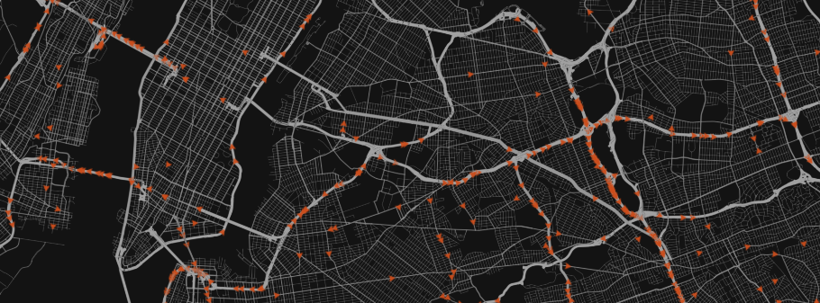

# Microscopic Traffic Simulation
with OpenStreetMap data.



## News
After a huge redesign of the simulations/scenarios and the vehicle logic, we want to implement contraction hierarchies for faster route calculations before we are going to make the simulation execution deterministic by guarantee. For now, the determinism should be (almost) given but it is not formally tested yet.

Finishing these (hopefully in the end of February 2017), we start developing multilane logic. This is used in a bachelor thesis for traffic jam cause research.

The implementation of polygon triangulation for a more complex visualization has been finished. In future, we want to use this for defining own scenarios by selecting polygonal start areas. In addition, buildings should be visualized as well (already done in subbranch).


## Demonstration and Examples
Demonstrations and examples can be executed using `gradle`. All OpenStreetMap (OSM) files need to be in the OSM XML format, as, for example, provided by the [OpenStreetMap web interface](https://www.openstreetmap.org). A (somewhat) stable demonstration can be executed from the `master`-branch (see Main UI).

#### Main UI
The main UI provides an overview of the simulation. The scenario is currently fixed (random routes), however various simulation parameters, as well as the number of vehicles and the used map, can be adjusted

```shell
./gradlew :microtrafficsim-ui:run
```

#### Fixed Simulation Example
The fixed simulation example features a fixed scenario and fixed parameters, It represents a former state of development, therefore the simulation parameters can't be changed without changing code. It can be executed using
```shell
./gradlew :examples:simulation:run -Dexec.args="<path to OSM-XML file>"
```

#### Map-Viewer Example
The map-viewer example can be executed using
```shell
./gradlew :examples:mapviewer:run -Dexec.args="<path to OSM-XML file>"
```


## Supported traffic attributes
* different vehicle types (inclusive different max velocities, acceleration
  functions etc.)
* static routing: fastest vs. shortest route
* streets' max velocity
* single laned streets

All following attributes can be en-/disabled.

* crossing logic: street priorities
* crossing logic: right-before-left XOR left-before-right XOR random
* "friendly-standing-in-jam": If a vehicle has to wait at a crossroad, it
  relinquishes its right of way for an other vehicle that has not to wait.


## Please Note
This software is still in an experimental state.


## Current contributors

**Fabian Franzelin**  
has been our supervisor for the first 6 months and he is still helping us in monthly/weekly meetings with advices and his experience.

**Maximilian Luz**  
is part of our team since beginning. He has written the OSM parser and is our visualization guy.

**Dominic Parga Cacheiro**  
is part of our team since beginning. As well as managing organizational work, he developes and improves the vehicle/traffic logic and shortest path algorithms. He also implements the user interface.


## Former contributors
Some people have worked on this project, but there is no right place to name them. Thus we name them here.

**Jan-Oliver Schmidt**  
has been part of our team in the very first 6 months. He worked at the single-laned traffic logic, the shortest path algorithms (especially A-star) and our first paper.


## Papers

####[Microscopic Traffic Simulation](https://www.informatik.uni-stuttgart.de/studium/interessierte/bsc-studiengaenge/informatik/projekt-inf/2016-06-03/Gruppe_5.pdf)
Mobility plays a huge role in modern society and is the reason for the necessity of a well developed and carefully planned infrastructure. Unfortunately, the volume of traffic is irregular and its flow is influenced on certain, hardly controllable parameters (such as weather) which leads to the occurance of traffic jams. Observing reasons for the emergence of such phenomneas in reality is difficult, trying to predict bottlenecks on planned streets without a simulation almost impossible. This paper deals with an approach to a real-time microscopic traffic simulation, based on OpenStreetMap data and single-laned streets. We base this approach on the well known Nagel-Schreckenberg model which we later extend, and will focus on explaining the logic at crossroads.

*Please consider: The only appearance of the word "evaluation" is misspelled as "evacuation", which could be a word you are looking for. Furthermore, due to an implementation bug, unfortunately our examples in the following paper are wrong. Theory is correct.*
