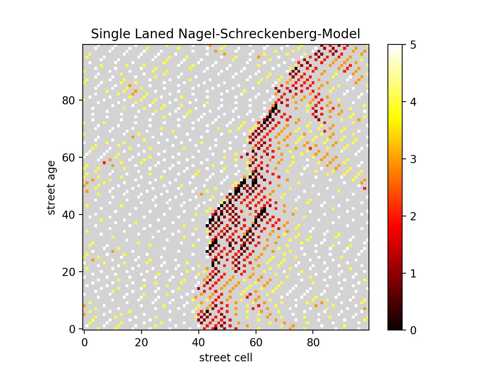

# Microscopic Traffic Simulation - Single Laned

## Requirements

* `python3`

using the python packages
* `matplotlib`
* `numpy`

## Usage

The execution command is `py src/main.py`.
For further information, call `py src/main.py -h`.

## What you can see

The x-axis shows a whole 1D-street and its vehicles.
The y-axis shows the timeline.
This means a line at y-value 40 was the current street 40 steps ago.
The colorbar shows the velocity of the vehicles in `cells per second`.
In short, `1 cps = 27 km/h`.
For more information about this, see our section about [the Nagel-Schreckenberg-Model in the wiki](https://github.com/sgs-us/microtrafficsim/wiki/Implementation-Details#nagel-schreckenberg-model).
